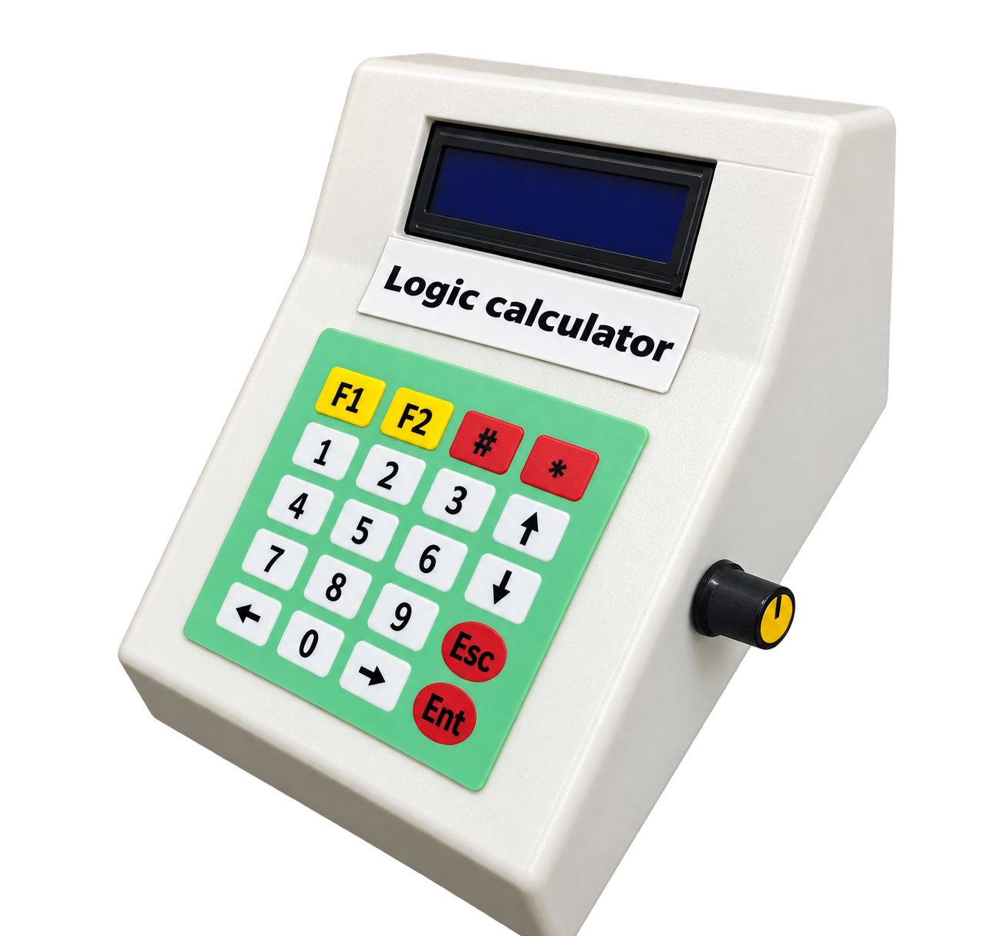
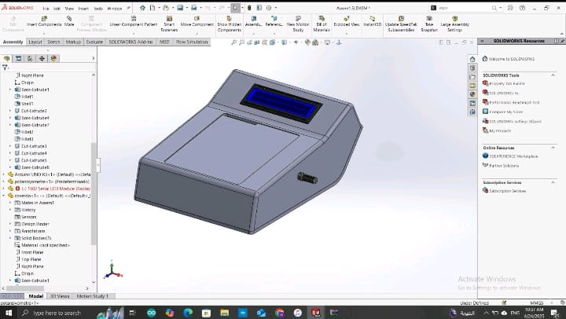
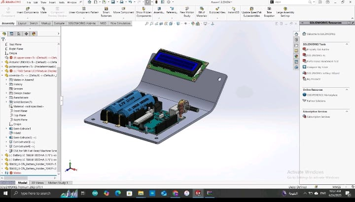
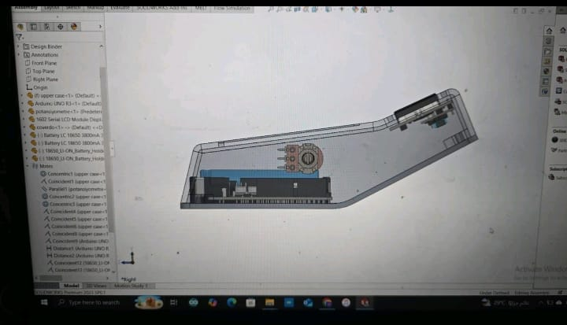
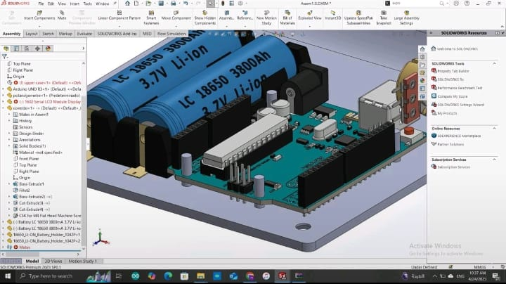
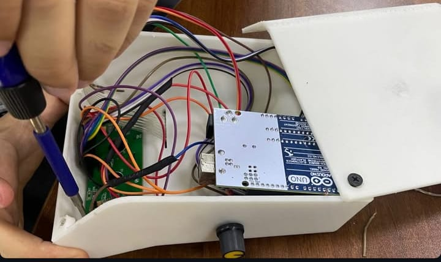

# Logic Calculator

A handheld, Arduino-based multi-mode calculator with a custom 3D-printed enclosure designed in SolidWorks.
It runs on an Arduino UNO with a 16x2 LCD and a 5x4 keypad, and includes basic and scientific calculation,
unit and currency converters, and a small math game.



## Features

| Mode | What it does |
|------|--------------|
| Basic | `+ - x /` with decimal input |
| Scientific | Basic plus a power (`^`) operator in the evaluator (see [Known issues](#known-issues)) |
| Unit converter | kg<->g, km<->m, C<->F |
| Currency converter | USD / EUR / GBP / SAR to EGP (fixed rates) |
| Math game | Random `+ - x /` questions, 3 attempts, score counter |

## Hardware

- Arduino UNO R3
- 16x2 character LCD (parallel, 4-bit mode, no I2C)
- 5x4 membrane keypad (20 keys)
- Potentiometer (knob on the side of the case, LCD contrast)
- 2 x 18650 Li-ion cells (3.7 V, 3800 mAh) with holders
- 3D-printed enclosure (designed in SolidWorks)

## Pin mapping

**LCD** (`LiquidCrystal`)

| LCD pin | Arduino pin |
|---------|-------------|
| RS | 12 |
| EN | 11 |
| D4 | 5 |
| D5 | 4 |
| D6 | 3 |
| D7 | 2 |

**Keypad** (`Keypad`)

| Rows (top to bottom) | Arduino pins |
|----------------------|--------------|
| R1-R5 | 10, 9, 8, 7, 6 |

| Columns (left to right) | Arduino pins |
|-------------------------|--------------|
| C1-C4 | 13, A4 (18), A5 (19), A3 (17) |

**Keypad layout**

```
[F1] [F2] [#]  [*]
[1]  [2]  [3]  [Up]
[4]  [5]  [6]  [Down]
[7]  [8]  [9]  [Esc]
[Left] [0] [Right] [Ent]
```

## Controls

- **Menu:** Up / Down to choose a mode, `Ent` or `#` to confirm.
- **Basic / Scientific:** `F1` = `+`, `F2` = `-`, `*` = multiply, `#` = divide, `Ent` = equals, `Esc` = clear, Left arrow = decimal point.
- **Converters:** Up / Down to change the conversion type, type a number, `Ent` to convert, `Esc` to clear, Left arrow = decimal point.
- **Game:** type the answer, `Ent` to submit, `Esc` to clear.
- **Back to menu:** press `#` twice quickly (inside any mode).

## Software

1. Install the Arduino IDE.
2. Install the **Keypad** library (Library Manager, search "Keypad" by Mark Stanley and Alexander Brevig).
   `LiquidCrystal` ships with the IDE.
3. Open `firmware/Logic_Calculator/Logic_Calculator.ino`.
4. Select **Arduino Uno**, pick the port, and upload.

Serial output at 9600 baud prints debug messages (pressed keys, current expression).

## Enclosure design (SolidWorks)

| | |
|---|---|
|  |  |
|  |  |

## Build



## Known issues

- **Power operator is not reachable.** `^` is handled by the evaluator, but `powerMode` is never set to `true`,
  so Scientific mode currently behaves like Basic mode.
- **No operator precedence.** Expressions are evaluated left to right (e.g. `2 + 3 x 4` gives 20).
- **Currency rates are hardcoded** in `convertCurrency()` and need manual updates.
- **Long expressions overflow** the 16-character LCD line.

## Project structure

```
Logic-Calculator/
|-- firmware/Logic_Calculator/Logic_Calculator.ino
|-- images/
|-- README.md
`-- .gitignore
```

## Author

Noura Maher Elamin - Computer & Information Systems, Egyptian Chinese University
